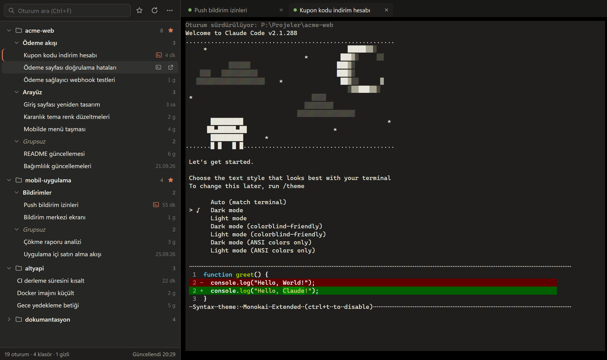
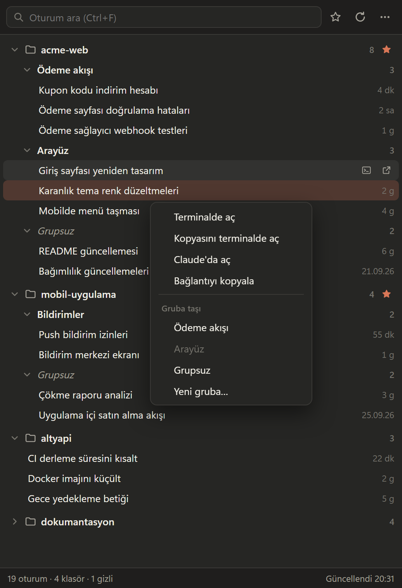
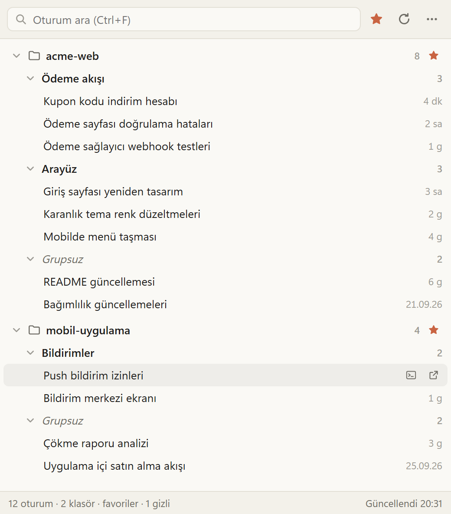

# SessionBoard

Claude masaüstü uygulamasındaki Claude Code oturumlarını **workspace → grup → oturum** ağacında
düzenleyen küçük bir Windows uygulaması. Claude'un kenar çubuğu aynı anda yalnız tek ölçüte göre
gruplayabildiği için (klasör *ya da* özel gruplar) bu ihtiyaç ayrı bir pencerede karşılanır. Oturumlar
istenirse uygulamanın içindeki terminalde (`claude --resume`) sürdürülebilir.



| Sağ tık menüsü | Yalnız favoriler (açık tema) |
| --- | --- |
|  |  |

<sub>Ekran görüntülerindeki projeler ve oturumlar örnek veridir.</sub>

## Gereksinimler

- Windows 10/11 (WebView2 çalışma zamanı ile)
- Claude masaüstü uygulaması (oturum listesi onun kayıtlarından okunur)
- Gömülü terminal için: bağımsız Claude Code CLI — bkz. [Terminal](#terminal)

## Kullanım

- **Tek tık yalnız seçer**, hiçbir şey açmaz. Oturumun üzerine gelince iki düğme çıkar:
  **terminal** (oturumu sağdaki terminalde `claude --resume` ile sürdürür; açıksa o sekmeye geçer) ve
  **Claude'da aç** (masaüstü uygulamada açar). Sağ tıkta ikisi de var, ayrıca **Kopyasını terminalde aç**
  (`--fork-session`: konuşmanın kopyasıyla yeni oturum, asıl oturum değişmez).
- **Terminal sekmeleri:** her oturum bir sekme; orta tık/× kapatır (çalışan Claude sonlanır, konuşma kaydı kalır).
  Seçim varken `Ctrl+C`/sağ tık kopyalar, seçim yokken `Ctrl+C` Claude'a gider; `Ctrl+V` yapıştırır.
  Ağaçla terminal arasındaki çizgi sürüklenerek genişlik ayarlanır.
- **Favoriler:** klasör satırındaki ☆ ile ekle; üst çubuktaki ★ yalnız favori klasörleri gösterir.
- **Gizle/göster:** klasör satırındaki göz düğmesi; gizlileri görmek için ⋯ → *Gizli klasörleri göster*.
- **Klasör sırası:** klasör satırını sürükleyip başka bir klasörün önüne/arkasına bırak (sağ tıkta yukarı/aşağı da var).
- **Grup ekle:** klasör satırındaki **+** düğmesi veya sağ tık → *Grup ekle*.
- **Taşı:** oturumu gruba sürükle-bırak, ya da sağ tık → *Gruba taşı*. *Grupsuz*'a bırakmak gruptan çıkarır.
- **Çoklu seçim:** `Ctrl` + tık (tek tek), `Shift` + tık (aralık). Seçili oturumlar birlikte sürüklenir/taşınır.
- **Klasör işlemleri (sağ tık):** yeniden adlandır, yukarı/aşağı taşı, gizle,
  *başka klasörün altına kat* (ör. bir projeyi yeni bir klasöre taşıdıysan, eski klasörde kalan oturumları
  yenisinin altında topla; *Ayır* ile geri alınır).
- **Grup işlemleri (sağ tık):** yeniden adlandır, yukarı/aşağı taşı, sil (oturumlar Grupsuz'a döner).
- **Arama:** `Ctrl+F`; Türkçe karakterlere duyarsız (`cetele` → *Çetele*).
- **⋯ menüsü:** arşivlenmiş oturumlar, gizli klasörler, her zaman üstte, tümünü daralt/genişlet.
- Liste 20 sn'de bir ve pencere odaklandığında kendiliğinden yenilenir; `F5` elle yeniler.

## Nasıl çalışır

| Konu | Ayrıntı |
|------|---------|
| Oturum listesi | `<kök>\<hesap>\<org>\local_*.json` — **salt-okuma**. Kök: `%LOCALAPPDATA%\Packages\Claude_*\LocalCache\Roaming\Claude\claude-code-sessions` (Claude MSIX/Store paketi; AppData'sı sanallaştırıldığı için kayıtlar fiziksel olarak burada) veya klasik kurulumda `%APPDATA%\Claude\claude-code-sessions` |
| Workspace | Kaydın `originCwd` alanı; worktree oturumları (`…\.claude\worktrees\…`) reponun köküne bağlanır |
| Hesap | Birden çok hesap klasörü varsa en son etkinliğin olduğu hesap gösterilir |
| Oturumu açma | `claude://claude.ai/epitaxy/<oturum-id>` bağlantısı → Windows'ta kayıtlı Claude protokol işleyicisi |
| Terminal | Sözde terminal (ConPTY, `portable-pty`) + xterm.js. Komut: `claude --resume <cliSessionId> [--fork-session] [--permission-mode <mod>]`, çalışma klasörü oturumun `cwd`'si. İzin modu masaüstündeki kayıttan gelir (`bypassPermissions` bilerek geçirilmez) |
| Son etkinlik | Masaüstü kaydı ile konuşma dosyasının (`~\.claude\projects\…\<cliSessionId>.jsonl`) değiştirilme zamanının büyüğü — terminalde çalışınca da güncellenir |
| Kendi durumu | `%USERPROFILE%\.sessionboard\state.json` (her kayıtta önceki sürüm `state.json.bak`). AppData'da değil: SessionBoard Claude'un terminalinden açılırsa MSIX paketi içinde çalışır ve AppData yazımları pakete yönlenir; profil kökü sanallaştırılmaz |

> ⚠️ Claude'un oturum kayıtları **belgelenmemiş iç biçimdir**. Bir Claude güncellemesi biçimi
> değiştirirse liste boş/eksik gelebilir (alt çubukta "N kayıt okunamadı" görünür). Uygulama Claude'un
> dosyalarına hiçbir şey yazmaz; gruplar yalnız `state.json`'dadır.

## Terminal

Gömülü terminal **bağımsız Claude Code CLI** ister; masaüstü uygulamanın kendi içindeki kopyası
kullanılamaz (onun oturum açma bilgisini masaüstü uygulama sağlar). Windows Terminal ya da PowerShell'de
bir kez kur ve giriş yap:

```powershell
irm https://claude.ai/install.ps1 | iex
claude   # tarayıcıdan giriş yap, sonra /exit
```

SessionBoard `claude`'u PATH'te, `%USERPROFILE%\.local\bin`'de ve `%APPDATA%\npm`'de arar; kurulumdan
sonra yeniden başlatmak gerekmez. SessionBoard Claude'un içinden başlatıldıysa masaüstünün kendi
süreçlerine verdiği `CLAUDE*` / `ANTHROPIC_BASE_URL` değişkenleri terminaldeki CLI'ye aktarılmaz.

> ⚠️ Aynı oturumu terminalde ve Claude penceresinde **aynı anda** kullanma: ikisi aynı konuşma dosyasına
> yazar. Emin değilsen *Kopyasını terminalde aç*'ı kullan.

## Derleme

Ön koşullar: Node.js, Rust (`x86_64-pc-windows-msvc`), Visual Studio veya Build Tools'ta
**"C++ ile masaüstü geliştirme"** iş yükü.

```powershell
npm install
npm run build   # → src-tauri\target\release\bundle\nsis\SessionBoard_<sürüm>_x64-setup.exe
```

`npm run build` / `npm run dev` önce xterm.js dosyalarını `node_modules`'tan `src/vendor`'a kopyalar
(`npm run vendor`); bu klasör depoda tutulmaz.

**Sorun giderme — `LNK1104: cannot open file 'msvcrt.lib'`:** Rust bilgisayardaki en yeni Visual Studio
kurulumunu seçer; o kurulumda C++ masaüstü (x64) kütüphaneleri eksikse bağlayıcı bu hatayı verir. Ya o
kurulumu Visual Studio Installer'dan tamamla ya da derlemeyi tam bir kurulumun x64 geliştirici ortamında
çalıştır:

```powershell
cmd /c '"<Visual Studio klasörü>\VC\Auxiliary\Build\vcvars64.bat" && npm run build'
```

## Testler

```powershell
cd src-tauri; cargo test                         # birim testleri (ConPTY testi dahil)
cd src-tauri; cargo test -- --include-ignored    # + bilgisayardaki Claude kayıtlarıyla duman testi
```
